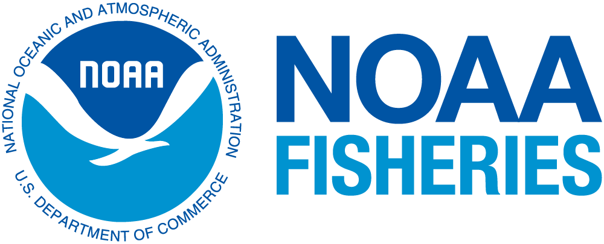

<!-- README.md is generated from README.Rmd. Please edit that file -->


<!-- You'll still need to render `README.Rmd` regularly, to keep `README.md` -->
<!-- up-to-date. `devtools::build_readme()` is handy for this. -->

```{r, include = FALSE}
knitr::opts_chunk$set(
  collapse = TRUE,
  comment = "#>",
  fig.path = "man/figures/README-",
  out.width = "100%"
)
```

# purcprod

**An app built by NOAA for exploring economic data of US West Coast
fisheries**

## 🚀 Launch the app here: [link]()


------------------------------------------------------------------------

## 🧭 About the app

This Shiny App (built in R) is a tool that was developed to assist the
Economic Data Collection Program at the
<a href="https://www.fisheries.noaa.gov/about/northwest-fisheries-science-center" target="_blank">Northwest
Fisheries Science Center</a> make its fisheries data available to the
public. Data is collected annually from the West Coast Groundfish Trawl
Fishery as required by
<a href="https://www.ecfr.gov/current/title-50/chapter-VI/part-660/subpart-D/section-660.114" target="_blank">regulation
50 CFR 660.114</a>. This app aggregates, summarizes, and compares
various facets of this data pertaining to the purchase and production of
the West Coast Groundfish Trawl Catch Share Program.

### Notes for Developers


This app was built using the `{golem}` framework, which structures Shiny
applications as R packages to support modular design, easier testing,
and long term maintainability/collaboration. The app’s
components scripts are as follows: 

-  `fct_*.R` and `utils_*.R` contain functions for the UI of the app including figures, widgets, layouts, ets. 

-  `mod_*.R` scripts contain UI and server code to a specific tab or piece of the app, making the codebase easier to navigate and work on


Configuration settings are managed through the `golem-config.yml` file,
which centralizes environment specific options. The project also uses `{renv}`
to lock package versions and make development more reliabel over time. The `renv.lock` file captures the exact versions of all packages used during development. This allows collaborators
to recreate the same environment with `renv::restore()`. If contributing
to this application, please follow the `{golem}` and `{renv}`
conventions to maintain consistency and reliability throughout
development. If any issues arise, please reach out to me at <a href="mailto:raymond.hunter@noaa.gov" class="email"><strong>raymond.hunter@noaa.gov</strong></a>

------------------------------------------------------------------------

## ✨ Features

### **Overview page**

-   A broad look at species catch value and weight by year
-   Compare total production value and weight of species over time
-   Select a specific year of interest and compare it to another year or
    average over multiple years
    -   Use the **year selector** and **date range slider** to customize
        the comparison

### **Explore the Data**

-   A more granular look into the facets of the data with tabs
    including:
    -   **Summary**
    -   **By Product Type**
    -   **By Species**
-   Filter by a metric, statistic, region, processor type, and more
-   View output as interactive time series plots or downloadable tables


### **Directory Tree**
```{r dir-tree, echo=FALSE, comment=''}
fs::dir_tree()
```

------------------------------------------------------------------------

## 📊 Data

The app uses data collected annually from participants in the West Coast
Groundfish Trawl Fishery. As of **April 2025**, the app contains data
through the **2023 calendar year**.

**UPDATING THE DATA:** The app data should be updated annually as new data becomes
available. To update the data, please follow these steps:

1) Obtain the latest `purcprod_data.RData` file from `fisheye_dataprep/dataprep_purcprod` repo and move it into the `data-raw` folder of this repo.

2) Open the `data_processing.R` script in the `data-raw` folder and run the script to process the new data and create updated internal data files. Make sure the data is loaded and the `usethis::use_data()` function is called to save the processed data in the app. This step is critical to ensure new data is properly integrated into the app.

3) Re-run app to verify everything is working as expected with the new data.

Data collection is part of NOAA’s [Economic Data Collection
Program](https://www.fisheries.noaa.gov/west-coast/science-data/economic-data-collection-west-coast-groundfish-trawl-fishery).

------------------------------------------------------------------------

## 📬 Send us a message!

We welcome feedback, suggestions, and questions regarding the app and
data.

📧
[**nmfs.nwfsc.fisheye\@noaa.gov**](mailto:nmfs.nwfsc.fisheye@noaa.gov){.email}

------------------------------------------------------------------------



[U.S. Department of Commerce](https://www.commerce.gov/) \| [National
Oceanographic and Atmospheric Administration](https://www.noaa.gov) \|
[NOAA Fisheries](https://www.fisheries.noaa.gov/)

